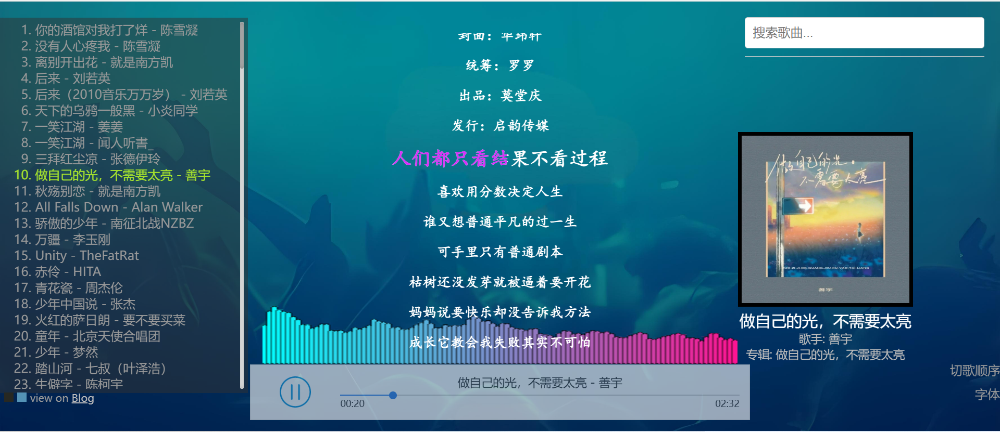
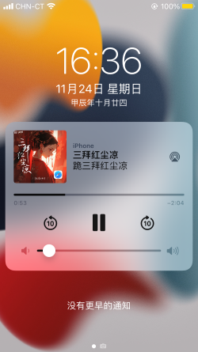
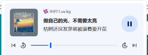
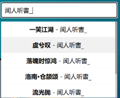
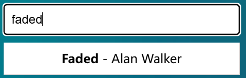
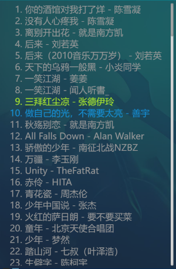
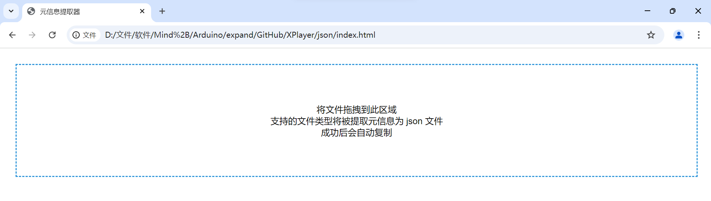
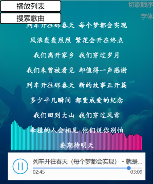

[English | 英文](#English)

[Chinese | 中文](#中文)

# English

> Because I(TH911) am Chinese,the main language of XPlayer is Chinese.The language of lyrics is Chinese,to.

## Introduction

A simple **static** music player.

Preview:



## Features

### Scrolling and Word-by-Word Lyrics

Supports both traditional `lrc` format lyrics and `xrc` format **word-by-word lyrics**, which can scroll.

It will first attempt to load the `xrc` format word-by-word lyrics, and if that fails, it will attempt to load the traditional `lrc` format lyrics.

There are five colors for the lyrics, chosen randomly each time.

Five color hex codes are: `#FAFA17`, `#FF1493`, `#ADFF2F`, `#D731F8`,`#00CC65`.

They're : $\colorbox{black}{\colorbox{#FAFA17}{\color{#FAFA17}{1}}\ \colorbox{#FF1493}{\color{#FF1493}{1}}\ \colorbox{#ADFF2F}{\color{#ADFF2F}{1}} \ \colorbox{#D731F8}{\color{#D731F8}{1}}\ \colorbox{#00CC65}{\color{#00CC65}{1}}}$ .

#### `xrc` Format

It is essentially a decrypted word-by-word lyrics file from a certain platform, with a changed file extension.

The final file is in XML format, with each line looking like:

```
[0,250]你(0,16)的(16,16)酒(32,16)馆(48,16)对(64,16)我(80,16)打(96,16)了(112,16)烊(128,16) (144,16)-(160,16) (176,16)陈(192,16)雪(208,16)凝(224,16)
```

The `[]` contains the start time and **duration** (in milliseconds) for that line, while after `[]`, there are groups of data like `a(b,c)`, where `a` is the word (or phrase), `b` is the start time, and `c` is the end time.

### Hardware Information Display Support

Supports displaying information via the Media Session API, like lock screen lyrics on iOS:



On Chrome:



### Search

Searches for song number, song title, artist name, and album name, **case insensitive**.





### Multi-font Support

In addition to the default font, six fonts are supported: Fangzheng Shuti, KaiTi, SongTi, Huawen Xingkai, and YouYuan.

Fonts are provided in `woff2`, `woff`, and `ttf` formats.

### Order

Supports four play modes: sequential play, reverse play, shuffle play, and single loop.

Shuffle play **doesn't** repeat songs that have already been played before the page is closed, unless all songs have been played.

### Playlist



Played songs are marked in blue, the currently playing song in green, and others in gray.

### Player Background

You can use `img/bg.png` or a solid black background, adjustable via the button in the bottom left of the playlist.

### Song Info Display

Displays the song title, artist, album, and album cover next to the lyrics.

The album cover has a black border with a width of 5px.

### Interactive Progress Bar and Custom Play Button

To avoid differences across different devices and browsers.

### Keyboard Interactions

- Space: Pause/Resume.
- $\uparrow$: Previous song.
- $\downarrow$: Next song.
- $\leftarrow$: Rewind 10s.
- $\rightarrow$: Fast forward 10s.

Uses responsive design, see [Technical Implementation/API](#API) for more.

### Spectrum Bar

As shown in the image.

## Technical Implementation

### json file

XPlayer, being a static player, requires a `json` file as its configuration, located at `json/content.json`.

`content.json` stores five pieces of information for each song: `song_name`, `artist`, `album`, `lrc_name`, and `duration`. The first three are the song title, artist name, and album title, `lrc_name` is the song's source filename, and `duration` is the song's length.

Due to issues with obtaining the `.duration` property for streaming `.mp3` files on iOS, the duration is predefined.

#### json File Generation

Manually writing it is extremely **inefficient**, so a tool has been created to generate `content.json`.

The tool is located at `json/index.html`, or you can directly access `json/`.



Just drag and drop.

It works by using the [jsmediatags project](https://github.com/aadsm/jsmediatags) to read metadata, and upon success, it will automatically copy the data.

### Song Source Files, Covers, and Lyrics Storage

All files are stored in the `music/` directory. The relevant files for the same song should share the same name (i.e., `lrc_name`).

Note: If a song's `.xrc` file already exists, an `.lrc` file is not necessary.

Song covers are stored in `webp` format with a size of $800\times 800$.

### API

> For easier secondary development.

- `PLAYER`

  The main player object, which includes functions for loading lyrics, updating the playlist, and loading configuration files.

- `pipWindow`

  See [Document Picture-in-Picture API](https://developer.mozilla.org/en-US/docs/Web/API/Document_Picture-in-Picture_API), which is the **interactive desktop lyrics** interface.

  This feature is currently incomplete.

  For songs without `xrc` lyrics, you can try pressing `p` in Chrome or Edge (see MDN) to enable it.

  Currently, it's not interactive.

- `responsiveDesign(flag_playlist)`

  A responsive design function that automatically adjusts the size of different parts.

  The standard for detecting mobile devices is: width is smaller than height or width is smaller than $800\text{px}$.



On mobile devices, the playlist and search bar are hidden as buttons, which can be expanded by clicking. The song info display box, including the cover, is completely hidden.

### Word-by-Word Lyrics

Uses the `animation` property in CSS, where the lyrics are parsed, and the `animation-duration` property is added to change the `background-size` from `0% 100%` to `100% 100%` (with the text color being transparent).

#### lyric file

Because `.xrc` use xm,so:

* `&` to `&amp;`
* `"` to `&quot;`
* `'` to `&apos`
* `<` to `&lt;`
* `>` to `&gt;`

# 中文

## 简介

一个简单的**静态**音乐播放器。

展示图：


## 功能介绍

### 滚动歌词与逐字歌词

同时支持传统 `lrc` 格式的歌词与 `xrc` 格式的**逐字歌词**，可滚动。

会先尝试加载 `xrc` 格式的逐字歌词，失败则会尝试加载 `lrc` 格式的传统歌词。

歌词的颜色有五种，每次随机选择。

五种颜色的十六进制码：`#FAFA17`、`#FF1493`、`#ADFF2F`、`#D731F8`,`#00CC65`。

预览：$\colorbox{black}{\colorbox{#FAFA17}{\color{#FAFA17}{1}}\ \colorbox{#FF1493}{\color{#FF1493}{1}}\ \colorbox{#ADFF2F}{\color{#ADFF2F}{1}} \ \colorbox{#D731F8}{\color{#D731F8}{1}}\ \colorbox{#00CC65}{\color{#00CC65}{1}}}$ 。

#### `xrc` 格式

其实就是国内某平台的逐字歌词文件解密后改了后缀名。

最终是 xml 格式的文件，每行形如：

```
[0,250]你(0,16)的(16,16)酒(32,16)馆(48,16)对(64,16)我(80,16)打(96,16)了(112,16)烊(128,16) (144,16)-(160,16) (176,16)陈(192,16)雪(208,16)凝(224,16)
```

`[]` 内表示这一行的开始时间与**持续时间**（单位：毫秒），从 `[]` 后到行末是一组组数据，形如 `a(b,c)`，`a` 是那个字（或单词等），`b` 表示其开始时间，`c` 表示其结束时间。

### 硬件信息显示支持

基于 Media Session API 的信息显示支持，如 iOS 下锁屏歌词：


Chrome下：


### 歌曲搜索

会搜索歌曲的编号、歌曲名、歌手名和专辑名，**不区分字母大小写**。


### 多字体支持

除默认字体外，支持方正舒体、楷体、宋体、华文行楷和幼圆共六种字体。

提供 `woff2`、`woff` 和 `ttf` 格式的字体。

### 切歌顺序

支持顺序播放、倒序播放、随机播放、单曲循环四种顺序。

随机播放**不会**播放页面关闭前**已经播放过的**歌曲，除非所有歌曲都已经放过。

### 播放列表


已经播放过的使用蓝色标记，正在播放的使用绿色标记，其余使用灰色。

### 播放器背景

可以使用 `img/bg.png` 或纯黑色，可通过播放列表左下角的按扭调整。

### 播放歌曲信息显示

在歌词右边，显示歌曲名、歌手名、专辑名及歌曲封面。

歌曲封面有宽度为 5px 的黑色边框。

### 可交互进度条与自定义播放按钮

避免在不同设备、浏览器上出现差异。

### 键盘交互

* 空格：暂停/继续播放。
* $\uparrow$：上一首。
* $\downarrow$：下一首。
* $\leftarrow$：快退 $10\text s$。
* $\rightarrow$：快进 $10\text s$。

### 移动端适配

使用响应式设计，详见[技术实现/接口](#接口)。

### 频谱条

如图。

## 技术实现

### 配置文件

XPlayer 作为静态播放器，肯定会需要一个 `json` 文件来作为配置文件，其目录在 `json/content.json`。

`content.json` 对于每一个歌曲都存储了五个信息：`song_name`、`artist`、`album`、`lrc_name` 和 `duration`。前三者分别是歌曲名、歌手名、专辑名，`lrc_name` 是歌曲源文件名，`duration` 是歌曲长度。

因为实测 iOS 下采用流式传输的 `.mp3` 源文件获取 `.duration` 属性会有问题，故预定义长度。

#### 配置文件的生成

人工写入无疑是非常**效率低下**的，故写了一个工具来生成 `content.json`。

其目录为 `json/index.html`，也可以直接访问 `json/`。


直接拖拽即可。

其原理是通过 [jsmediatags 项目](https://github.com/aadsm/jsmediatags) 读取元信息，成功后会自动复制。

### 歌曲源文件、封面、歌词存储

统一存储在 `music/` 下，同一个歌曲的相关文件应当同名（`lrc_name`）。

注意：当一个歌曲的 `.xrc` 文件已经存在时，可以不必要为其配备 `.lrc` 文件。

歌曲封面统一采用 `webp` 格式，大小为 $800\times 800$。

### 接口

> 便于二次开发。

* `PLAYER`

  整个播放器对象，包括加载歌词、更新播放列表、加载配置文件等。

* `pipWindow`

  见 [Document Picture-in-Picture API](https://developer.mozilla.org/zh-CN/docs/Web/API/Document_Picture-in-Picture_API)，是**可交互桌面歌词**的接口。

  但是目前尚未完成。

  对于没有加载 `xrc` 的歌曲，你可以在 Chrome 或 Edge（详见 MDN）下尝试按 `p` 来启用。

  目前尚不可交互。

* `responsiveDesign(flag_playlist)`

  响应式设计函数，会自动调整各部分的大小。

  判断是移动端的标准：宽度小于高度或宽度小于 $800\text{px}$。

  

  在移动端上，播放列表与搜索框会隐藏为按扭，点击则展开；包括封面在内的歌曲信息展示框会完全隐藏。

### 逐字歌词

使用 css 的 `animation` 属性，解析歌词后为其添加 `animation-duration` 属性操作 `background-size` 从 `0% 100%` 变为 `100% 100%`（文字颜色为透明）。

#### 文件解析

使用的是 xml 格式，因此应当注意：

* `&` 需被转义为 `&amp;`
* `"` 需被转义为 `&quot;`
* `'` 需被转义为 `&apos`
* `<` 被转义为 `&lt;`
* `>` 被转义为 `&gt;`
